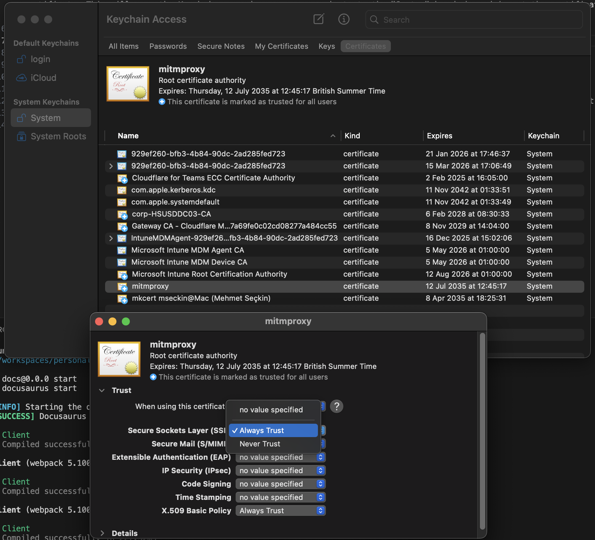

# Explanation: MacOS Setup Gotchas

## Executable locations in `.env`

The example `.env` file has Windows defaults for executable locations. The MacOS equivalent `.env` variables look like this:

```
# Path to your local mitmproxy executable  
MITMPROXY_PATH=/opt/homebrew/bin/mitmproxy

# Path to your Chrome executable  
CHROME_EXE_PATH="/Applications/Google Chrome.app/Contents/MacOS/Google Chrome"
```

## Setting up HTTPS interception

The main steps of downloading and installing the certificate from https://mitm.it should work. If you can download the certificate, you simply need to double-click the certificate. This will open the Keychain Access app, where you can navigate to the "System" keychain and import the certificate. Once imported, open the certificate trust settings ("Trust" section), and set SSL to "Always Trust":



Alternatively, you can use the following command in a terminal window. This will require `sudo` permissions:

```
sudo security add-trusted-cert -d -p ssl -p basic -k /Library/Keychains/System.keychain ~/.mitmproxy/mitmproxy-ca-cert.pem
```
